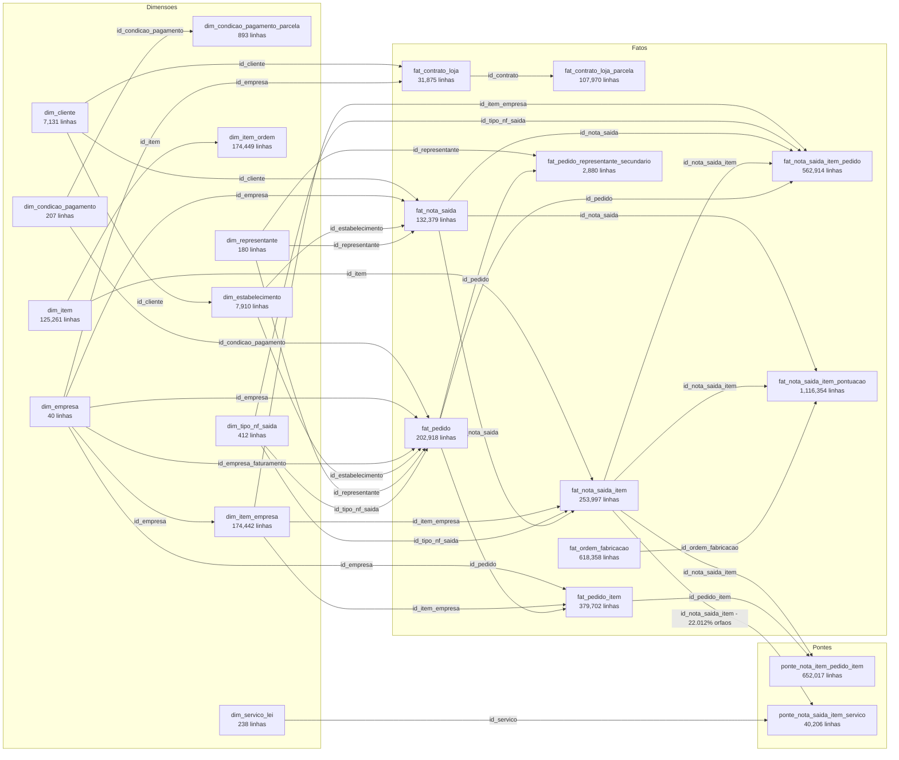
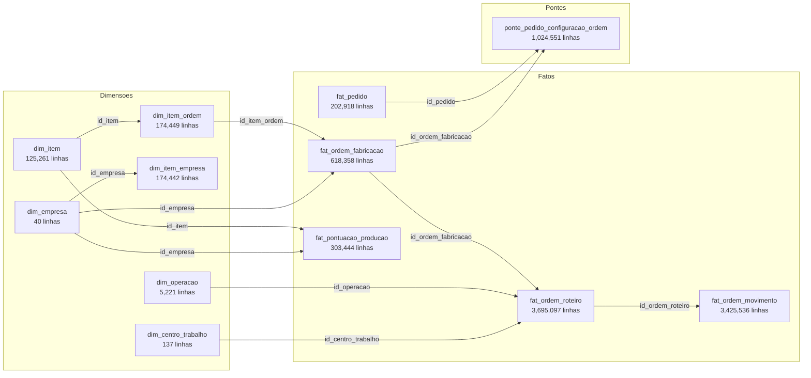
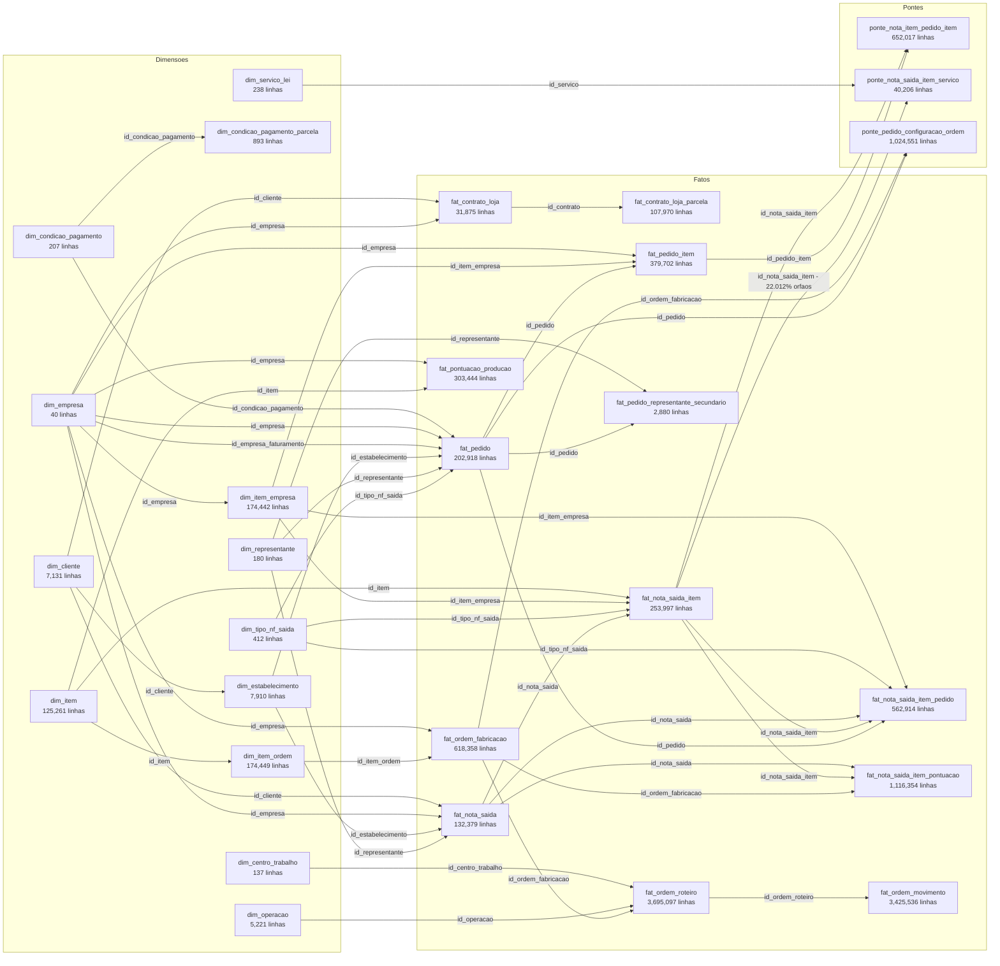

# Modelo — star schema de vendas e producao

> **O banco nao tem nenhuma FOREIGN KEY como constraint** — mas os COMMENTs de coluna declaram o alvo em texto, no formato `[FK -> dim_empresa.id_empresa]`. Essa e a fonte primaria aqui. Onde o comentario nao declara, o alvo foi inferido por convencao de nome (`coluna X` = PK simples da tabela cuja PK e `X`). **Todo relacionamento, declarado ou inferido, foi validado medindo orfaos no proprio Postgres** (`scripts/02_relacionamentos.py`); a coluna *orfaos* nas tabelas e a prova.

Gerado por `scripts/03_modelo.py`.

## Diagramas

### Vendas

### Producao

### Ligacao vendas ↔ producao

## dim_calendario (dimensao conformada por data)

`dim_calendario` tem PK `data` e nao aparece como FK em lugar nenhum: liga por igualdade de data, em varios papeis por fato. Papeis identificados no escopo:

- `fat_pedido`: `data_emissao`, `data_entrega_prevista`, `data_inclusao`
- `fat_nota_saida`: `data_emissao`, `data_saida`
- `fat_ordem_fabricacao`: `data_abertura`, `data_prevista_fim`, `data_inicio`, `data_fim`, `data_entrega`
- `fat_ordem_movimento`: `data_apontamento`
- `fat_pontuacao_producao`: `data_referencia`
- `fat_contrato_loja`: `data_contrato`, `data_assinatura`
- `ponte_nota_item_pedido_item`: `data_vinculo`

## Relacionamentos validados

### Vendas

| de | coluna | para | coluna | linhas | nulos | orfaos |
|----|--------|------|--------|-------:|------:|-------:|
| `fat_contrato_loja` | `id_cliente` | `dim_cliente` | `id_cliente` | 31,875 | 0 | 0 |
| `fat_contrato_loja` | `id_empresa` | `dim_empresa` | `id_empresa` | 31,875 | 0 | 0 |
| `fat_contrato_loja_parcela` | `id_contrato` | `fat_contrato_loja` | `id_contrato` | 107,970 | 0 | 0 |
| `fat_nota_saida` | `id_cliente` | `dim_cliente` | `id_cliente` | 132,407 | 0 | 0 |
| `fat_nota_saida` | `id_empresa` | `dim_empresa` | `id_empresa` | 132,407 | 0 | 0 |
| `fat_nota_saida` | `id_estabelecimento` | `dim_estabelecimento` | `id_estabelecimento` | 132,407 | 0 | 0 |
| `fat_nota_saida` | `id_representante` | `dim_representante` | `id_representante` | 132,407 | 329 | 0 |
| `fat_nota_saida_item` | `id_item` | `dim_item` | `id_item` | 254,031 | 0 | 0 |
| `fat_nota_saida_item` | `id_item_empresa` | `dim_item_empresa` | `id_item_empresa` | 254,031 | 0 | 0 |
| `fat_nota_saida_item` | `id_nota_saida` | `fat_nota_saida` | `id_nota_saida` | 254,031 | 0 | 0 |
| `fat_nota_saida_item` | `id_tipo_nf_saida` | `dim_tipo_nf_saida` | `id_tipo_nf_saida` | 254,031 | 0 | 0 |
| `fat_nota_saida_item_pedido` | `id_item_empresa` | `dim_item_empresa` | `id_item_empresa` | 562,914 | 0 | 0 |
| `fat_nota_saida_item_pedido` | `id_nota_saida` | `fat_nota_saida` | `id_nota_saida` | 562,914 | 0 | 0 |
| `fat_nota_saida_item_pedido` | `id_nota_saida_item` | `fat_nota_saida_item` | `id_nota_saida_item` | 562,914 | 0 | 0 |
| `fat_nota_saida_item_pedido` | `id_pedido` | `fat_pedido` | `id_pedido` | 562,914 | 0 | 0 |
| `fat_nota_saida_item_pedido` | `id_tipo_nf_saida` | `dim_tipo_nf_saida` | `id_tipo_nf_saida` | 562,914 | 0 | 0 |
| `fat_nota_saida_item_pontuacao` | `id_nota_saida` | `fat_nota_saida` | `id_nota_saida` | 1,116,354 | 0 | 0 |
| `fat_nota_saida_item_pontuacao` | `id_nota_saida_item` | `fat_nota_saida_item` | `id_nota_saida_item` | 1,116,354 | 0 | 0 |
| `fat_nota_saida_item_pontuacao` | `id_ordem_fabricacao` | `fat_ordem_fabricacao` | `num_ordem` | 1,116,354 | 0 | 0 |
| `fat_pedido` | `id_condicao_pagamento` | `dim_condicao_pagamento` | `id_condicao_pagamento` | 202,918 | 4,066 | 0 |
| `fat_pedido` | `id_empresa` | `dim_empresa` | `id_empresa` | 202,918 | 0 | 0 |
| `fat_pedido` | `id_empresa_faturamento` | `dim_empresa` | `id_empresa` | 202,918 | 0 | 0 |
| `fat_pedido` | `id_estabelecimento` | `dim_estabelecimento` | `id_estabelecimento` | 202,918 | 0 | 0 |
| `fat_pedido` | `id_representante` | `dim_representante` | `id_representante` | 202,918 | 4,044 | 0 |
| `fat_pedido` | `id_tipo_nf_saida` | `dim_tipo_nf_saida` | `id_tipo_nf_saida` | 202,918 | 4,059 | 0 |
| `fat_pedido_item` | `id_empresa` | `dim_empresa` | `id_empresa` | 379,754 | 0 | 0 |
| `fat_pedido_item` | `id_item_empresa` | `dim_item_empresa` | `id_item_empresa` | 379,754 | 0 | 0 |
| `fat_pedido_item` | `id_pedido` | `fat_pedido` | `id_pedido` | 379,754 | 0 | 0 |
| `fat_pedido_representante_secundario` | `id_pedido` | `fat_pedido` | `id_pedido` | 2,880 | 0 | 0 |
| `fat_pedido_representante_secundario` | `id_representante` | `dim_representante` | `id_representante` | 2,880 | 0 | 0 |
| `ponte_nota_item_pedido_item` | `id_nota_saida_item` | `fat_nota_saida_item` | `id_nota_saida_item` | 652,017 | 89,103 | 0 |
| `ponte_nota_item_pedido_item` | `id_pedido_item` | `fat_pedido_item` | `id_pedido_item` | 652,017 | 0 | 0 |
| `ponte_nota_saida_item_servico` | `id_nota_saida_item` | `fat_nota_saida_item` | `id_nota_saida_item` | 40,206 | 0 | 8,850 (22.012%) |
| `ponte_nota_saida_item_servico` | `id_servico` | `dim_servico_lei` | `id_servico` | 40,206 | 0 | 0 |

### Producao

| de | coluna | para | coluna | linhas | nulos | orfaos |
|----|--------|------|--------|-------:|------:|-------:|
| `fat_ordem_fabricacao` | `id_empresa` | `dim_empresa` | `id_empresa` | 618,358 | 0 | 0 |
| `fat_ordem_fabricacao` | `id_item_ordem` | `dim_item_ordem` | `id_item_ordem` | 618,358 | 0 | 0 |
| `fat_ordem_movimento` | `id_ordem_roteiro` | `fat_ordem_roteiro` | `id_ordem_roteiro` | 3,425,536 | 0 | 0 |
| `fat_ordem_roteiro` | `id_centro_trabalho` | `dim_centro_trabalho` | `id_centro_trabalho` | 3,695,097 | 0 | 0 |
| `fat_ordem_roteiro` | `id_operacao` | `dim_operacao` | `id_operacao` | 3,695,097 | 0 | 0 |
| `fat_ordem_roteiro` | `id_ordem_fabricacao` | `fat_ordem_fabricacao` | `id_ordem_fabricacao` | 3,695,097 | 0 | 0 |
| `fat_pontuacao_producao` | `id_empresa` | `dim_empresa` | `id_empresa` | 303,444 | 0 | 0 |
| `fat_pontuacao_producao` | `id_item` | `dim_item` | `id_item` | 303,444 | 0 | 0 |
| `ponte_pedido_configuracao_ordem` | `id_ordem_fabricacao` | `fat_ordem_fabricacao` | `id_ordem_fabricacao` | 1,024,551 | 0 | 0 |
| `ponte_pedido_configuracao_ordem` | `id_pedido` | `fat_pedido` | `id_pedido` | 1,024,551 | 0 | 0 |

### Entre dimensoes (snowflake)

| de | coluna | para | coluna | linhas | nulos | orfaos |
|----|--------|------|--------|-------:|------:|-------:|
| `dim_centro_trabalho` | `id_centro_custo` | `dim_centro_custo` | `id_centro_custo` | 137 | 0 | 88 (64.234%) |
| `dim_condicao_pagamento_parcela` | `id_condicao_pagamento` | `dim_condicao_pagamento` | `id_condicao_pagamento` | 893 | 0 | 0 |
| `dim_empresa` | `id_cidade` | `dim_cidade` | `id_cidade` | 40 | 0 | 0 |
| `dim_estabelecimento` | `id_cidade` | `dim_cidade` | `id_cidade` | 7,910 | 0 | 0 |
| `dim_estabelecimento` | `id_cliente` | `dim_cliente` | `id_cliente` | 7,910 | 0 | 0 |
| `dim_item_empresa` | `id_empresa` | `dim_empresa` | `id_empresa` | 174,442 | 0 | 0 |
| `dim_item_ordem` | `id_item` | `dim_item` | `id_item` | 174,449 | 0 | 0 |

## Observacoes de modelagem

- **Nao existe `id_cliente` em `fat_pedido`.** O cliente do pedido so se alcanca por `fat_pedido → dim_estabelecimento → dim_cliente`. Ja `fat_nota_saida` tem `id_cliente` direto. Comparacoes pedido x faturamento por cliente precisam desse cuidado.
- **Duas dimensoes de item.** `dim_item` e o catalogo global (1 linha por codigo, usada por NF de saida e producao) e `dim_item_empresa` e o item por empresa, com **id proprio e diferente** (usada por pedido de venda e item de NF). `dim_item_ordem` e a visao de producao e faz a ponte para `dim_item`.
- **`fat_nota_saida_item_pontuacao.id_ordem_fabricacao` guarda `num_ordem`, nao a PK.** Contra `id_ordem_fabricacao` da 100% de orfaos; contra `num_ordem`, 0%. Sempre junte por `num_ordem`.
- `ponte_pedido_configuracao_ordem` e o unico caminho pedido ↔ ordem de fabricacao; grao = pedido x configuracao x ordem.
- `fat_pedido_representante_secundario` tem grao pedido x representante: somar valor por ela duplica faturamento.
